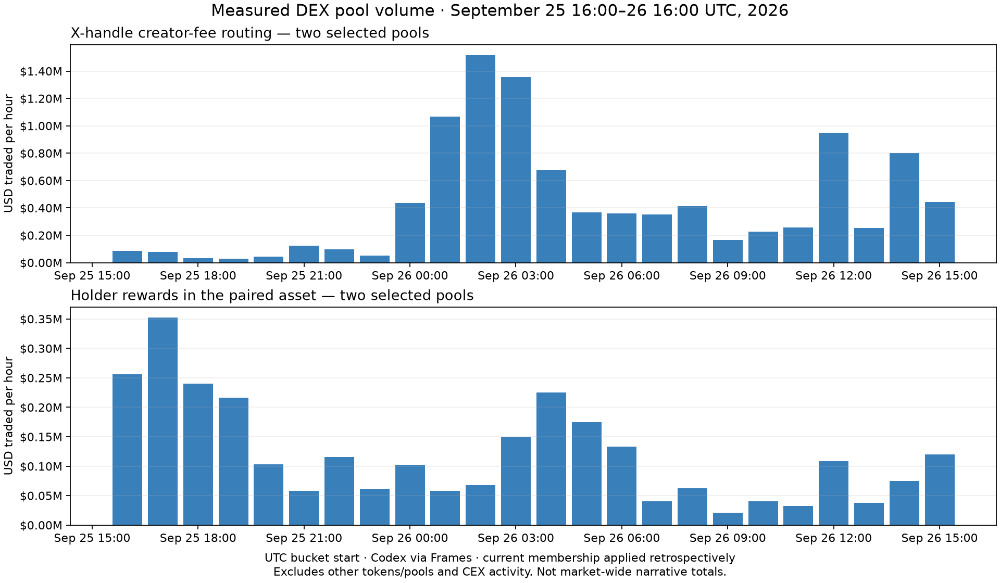

# LAMBLE: executed Frames acquisition

Packaged 2026-09-26T17:41:21.620516+00:00. Research start: 2026-09-26 17:24:34 UTC.

This run supersedes the earlier report’s paid-execution blocker. The user explicitly removed the overall spending ceiling. **51 catalog calls were invoked in eight terminal Frames runs; 46 were marked delivered. Actual billing: 230 credits; 84% remaining.** All raw returned bodies and exact requests are saved here. No application source was edited or deployed.

## What the landing can use

- Fee and revenue histories for all 19 mapped venue rows, with complete-day 1/7/30-day aggregates and changes where enough history exists. Four response bodies have disputed Frames delivery verdicts, described below. Fourteen rows have all 30 requested daily fee points; gaps remain null in the other five.
- Two evidence-backed narrative samples, four address-resolved tokens, two real 24-hour charts and two complete seven-day hourly charts. These measure four fixed DEX pools, including post-graduation trading attributed to reported launch origin. They are not all-market narrative totals.
- Actual timestamped X posts, official story/configuration pages, launchpad/provider mappings and canonical token identities. Branding and some identity facts are retained from the explicitly marked earlier public-source investigation.
- The current DTOs/UI need nullable fields, sample labels and provenance before these partial records can replace fixtures safely. No integration was performed.

## Measured narratives

Curated evidence-backed selection, ordered by measured sample 24-hour USD volume descending, then ID. No third story cleared the identity/evidence/history gate. Current classification is applied retrospectively; these charts do not demonstrate historical detection.

| Specific meta | Identified constituents | Selected-pool 24h USD volume | Selected-pool 7d USD volume |
|---|---|---:|---:|
| X-handle creator-fee routing | ELON, CALI | $10,181,456 | $19,242,456 |
| Holder rewards in the paired asset | ZCAT, KNOTS | $2,851,172 | $12,747,661 |

### X-handle creator-fee routing

[UsePaid’s documentation](https://usepaid.app/docs) describes routing a token’s creator fees to a named X handle; its [token registry](https://usepaid.app/) resolves CALI and Elon Coin to the exact contracts saved in tokens.json. Frames Firecrawl returned both pages. That shared recipient-routing behavior is the specific meta, rather than a general culture sector. The docs distinguish Pump.fun live support, Pons not yet live, and Four.meme exploration. The homepage’s broader venue wording conflicts with that detail; it does not establish live Pons payouts.

Frames X search returned a [September 26 ALX post](https://x.com/alx/status/2103695485118623883) discussing UsePaid fees, and a [September 25 recipient post](https://x.com/0xQuit/status/2103568713060602288) identifying another token while explicitly disclaiming endorsement. These establish public discussion, not verified payouts or membership of those extra tokens in the measured four-token sample. Token discoveries from those posts stay outside the chart until resolved and measured.

### Holder rewards in the paired asset

The [KNOTS website](https://www.knotsonstonk.com/) links the exact StonkFun token contract, explains the reversed STONK name and describes a transfer tax distributing STONK to KNOTS holders. The [September 21 ZCAT article](https://www.mexc.co/en-NG/learn/article/what-is-anonymous-cat-zcat-the-solana-meme-coin-paying-zec/1) identifies ZCAT’s contract, StonkFun origin and ZEC reward mechanism. Both were retrieved through Frames Firecrawl. The shared behavior is distributing the chosen paired asset to holders. ZEC and STONK themselves are excluded from constituent membership. No equity-ownership claim is inferred from a quote asset.

Frames X search also returned the [KNOTS posting-reward campaign](https://x.com/KnotsOnStonk/status/2099528749683224635) and its [reported distribution](https://x.com/KnotsOnStonk/status/2102801301449199906). This is a material attention bias: sampled posts cannot establish organic mindshare, and payout claims were not independently settled on chain.

### Chart definitions and validation

- Chart end: **2026-09-26 16:00 UTC**, with a one-complete-hour safety margin from acquisition start. Required interval: September 25 16:00 through September 26 16:00, exclusive end. Seven-day interval starts September 19 16:00 UTC.
- Each timestamp is a UTC bucket start in Unix seconds. Codex getBars used explicit fixed pool addresses, network ID 1399811149, resolution 60 and USD currency. Requests and all arrays are in raw/e1-request.json and raw/e1.json.
- Four arrays each contain exactly 168 non-null hourly volumes. Each narrative sums two distinct pools by timestamp; its last 24 buckets reconcile to volume24hUsd within $0.01. Seven-day sums reconcile under the same universe.
- A separate Frames query returned 60 one-minute CALI bars whose sum reconciles with the hourly bar within $0.01. Both to=T and to=T-1 excluded the T hour in that test. Refresh recipes conservatively request T-1 and explicitly clip [start,T).
- Pair turnover is counted once per selected pool. Multi-hop economic intent is not deduplicated; other pools, tokens and CEX activity are excluded. The original top-pool selection is frozen, not reranked during backfill.
- Codex and GeckoTerminal differ slightly in valuation/revisions. This run uses Codex consistently; prior observations remain timestamped in the previous directory. No generated shapes, rolling-snapshot summation, interpolation or daily spreading were used. Thirty daily narrative buckets, historical attention and breadth remain unavailable.

## Launchpad financials

Financial end: **2026-09-26 00:00 UTC**. h24 is the complete September 25 UTC date, not a rolling snapshot. For each duration W, current is [T-W,T), previous is [T-2W,T-W). change is fee percent change; missing/zero prior totals yield null. Every history30d retains exactly 30 UTC-midnight dates. Incomplete current-day rows are excluded even when the provider summary includes them.

| Venue | 1d fees / revenue | 7d fees / revenue | 30d fees / revenue | Unavailable window fields |
|---|---:|---:|---:|---|
| pump.fun | $1,724,583 / $1,233,641 | $11,350,419 / $8,189,116 | $45,278,232 / $32,549,464 | none |
| stonkfun | $779,116 / $779,116 | $8,938,795 / $8,938,795 | $23,643,697 / $23,643,697 | none |
| pons | $1,528,158 / $226,647 | $16,440,904 / $2,433,680 | $141,180,676 / $24,172,631 | d30.change |
| flap-sh | $727,148 / $194,409 | $7,620,167 / $1,859,979 | $38,363,800 / $9,739,078 | none |
| launchlab | $573,684 / $107,544 | $4,516,583 / $875,002 | $8,113,229 / $1,736,622 | none |
| bonk.fun | $455,204 / $268,739 | $3,635,751 / $2,162,069 | $7,075,592 / $4,204,413 | none |
| graphite-protocol | $179,157 / $179,157 | $1,441,444 / $1,441,444 | $2,810,726 / $2,810,726 | none |
| genius.fun | $45,121 / $11,440 | $1,363,715 / $353,819 | unknown / unknown | d7.change, d30.fees, d30.revenue, d30.change |
| argus-world | $148,380 / $25,963 | $727,690 / $85,913 | unknown / unknown | d30.fees, d30.revenue, d30.change |
| meteora-dbc | $86,816 / $15,889 | $486,809 / $88,573 | $1,241,854 / $228,832 | none |
| binance-alpha | $31,557 / $31,557 | $397,305 / $397,305 | $2,161,016 / $2,161,016 | none |
| o1-launchpad | $27,492 / $14,505 | $296,546 / $158,144 | $5,513,937 / $2,989,183 | none |
| clanker | $4,392 / $733 | $136,054 / $22,676 | $376,411 / $62,748 | none |
| stonkbrokers | $1,960 / $344 | $87,433 / $13,818 | unknown / unknown | d7.change, d30.fees, d30.revenue, d30.change |
| bags | $16,718 / $8,359 | $70,251 / $34,814 | $327,422 / $160,252 | none |
| rapid-launch | $6,899 / $5,963 | $43,897 / $37,912 | unknown / unknown | d7.change, d30.fees, d30.revenue, d30.change |
| basestonk | $3,646 / $1,875 | $39,806 / $21,140 | $405,603 / $283,426 | d30.change |
| four.meme | $5,844 / $5,684 | $37,573 / $36,418 | $224,020 / $219,080 | none |
| foci | $5,010 / $4,913 | $35,111 / $30,801 | unknown / unknown | d7.change, d30.fees, d30.revenue, d30.change |

All 19 rows still lack verified launched24h, launched7dAvg, graduated24h and graduationRate7d. Their official identity/configuration/branding field statuses are enumerated individually in contract-and-coverage.json. Unsupported chains, fee constants, USD graduation thresholds and local logo paths have not been guessed.

Pons maps to **Pons V2 only**. StonkBrokers maps to **Nightshades only**, not the entire platform. Fees and revenue follow each adapter’s saved methodology; creator earnings, protocol retention and tokenholder revenue are separate flows. Pump.fun’s adapter excludes PumpSwap trading as a separately tracked product; its curve/graduation financials must not be confused with the selected PumpSwap narrative-pool volume.

LaunchLab overlaps its branded frontends; Graphite overlaps BONK fee flows; Meteora DBC overlaps Bags activity. Do not sum all rows into a hero total. See entity-mapping.json and each row’s methodology/version metadata.

## Exact Frames outcomes

| Route | Actually returned | Use / limitation |
|---|---|---|
| mpp.codex.post.graphql | Four fixed-pool hourly volume arrays, seven-day backfill, minute/hour boundary validation | Three successful calls; usable measured sample charts |
| bazaar.defillama-use-x402atlas-com-fee-summary | 38 fee/revenue bodies for 19 mappings, daily charts and methodology | 34 delivered; four returned bodies rejected by date cross-check and independently validated below |
| mpp.firecrawl.post.v1-scrape | UsePaid docs/registry, KNOTS page, ZCAT story, Pump.fun fee documentation | Five delivered source pages with resolved story identities and configuration evidence |
| bazaar.twitter-use-x402atlas-com-search | 16 UsePaid and 20 KNOTS/STONK top-result posts with IDs/timestamps | Two delivered samples; useful signals, not totals or mindshare |
| bazaar.api-loopholetape-com-v1-base-launches-since | 100 distinct mint observations and cursor | Delivered but wrong since window, truncated, no tx/instruction finality proof |
| bazaar.x402-ottoai-services-twitter-summary | General crypto-news digest | Delivered but unsuitable for the selected narrative evidence; no usable primary post records |
| agentic.emc2ai-io..x402-bitquery-pumpfun-launches-raw | Exposure-cap error | Not delivered. Actual $0.60 demand exceeded seller’s $0.50 unproven-exposure allowance; no bypass attempted |

### Financial delivery disputes

Frames marked Pons V2 dailyRevenue, Graphite dailyFees, Genius.fun dailyRevenue and Foci dailyFees as seller errors because its model cross-check called the data future-dated. The complete response bodies were nevertheless returned and saved. Deterministic Unix conversion shows no dates after the runtime UTC date; all complete-day values exactly match the earlier direct DefiLlama responses. The current incomplete date is excluded. This is same-upstream corroboration, not an independent financial audit.

The dataset retains these independently validated bodies with their original failed-delivery receipts and explicit per-field evidence. No success verdict or charge was rewritten, and no paid retry was needed.

### Launch feed and sampling limits

The alternative feed requested since=1790352000 but returned since=1790440196.5385506. It contains 100 distinct mints, reports truncated=true and next_cursor=1790443270.765, while meta.next is null. Source-reported full coverage therefore does not prove requested-window exhaustion. Pagination stopped after one page because advancing this cursor would conceal the ignored input. launch-observations.json preserves the sample without promoting it to finalized creation counts or narrative membership.

Measured narratives cover Pump.fun and StonkFun; current launch discovery samples Pump.fun. The other 17 application rows were investigated financially/for identity but do not have validated narrative launch discovery in this run. The prior UsePaid registry sample and unresolved story candidates remain documented. No broad category or matching ticker was promoted into a third meta.

## Minimal integration changes

- Numeric DTO fields and Point.value need null; chart must map gaps to WhitespaceData and sparklines must break lines.
- Add explicit per-metric as-of, window, source and completeness; h24 financials are complete UTC day, not rolling 24h.
- Use explicit hasBondingCurve (nullable) and versioned configuration; never infer it from graduationTargetUsd.
- Separate curve completion and liquidity migration. Pons V1 liquidity milestone is not a curve graduation.
- Add chain+contract identity to contender/example token and evidence URLs/event times to Signal.
- Keep contender attention share null; approve explicit measured-volume-share label before using supplemental shares.
- topLaunchpads is launch share; no launch denominator means no volume-based substitution.
- mindshare/change24h/status/startedAt unsupported; firstObservedAt is separate.
- Calendar-day fees/revenue are adapter-defined. Revenue can include tokenholder flows; do not label it protocol-only retained revenue.
- Hero totals must partition overlapping engine/frontend fee flows and events, join histories by timestamp, and propagate missing coverage.
- External logo URLs require local asset ingestion or a contract change; no fictitious local paths.
- Launch here requires_internal_config. This research does not wire routes.
- relativeTime defaults to fixture SNAPSHOT_AT; runtime source dates need a real as-of value.
- Revenue percentage is clamped at 100% in UI; this can conceal mismatched source scope.
- Two narratives are curated measured samples, not market-wide top-three results. Order is sample volume descending, slug tie-break.
- Supported chains differ from metric coverage. Clanker homepage additionally lists BNB Chain; inspect versions before asserting exhaustive support.

## Smallest repeatable acquisition path

1. Reuse the saved four pool mappings and two memberships. One Codex Frames call with four aliases can refresh hourly volumes; reread a three-hour overlap and merge by chain/pool/bucket. Keep missing buckets null and preserve revisions.
2. Fetch 38 financial summaries daily in batches of at most ten. Recompute the complete UTC-day anchor; cache histories and reconcile the last seven days. The tested API returns full charts, so no unsupported incremental filter is claimed.
3. Refresh two focused X search samples every 30–60 minutes when operating explicitly. Deduplicate post IDs, retain timestamps and campaign bias, classify only meaningful new evidence. Check configuration/branding weekly or on official updates.
4. Repair/validate launch since/pagination and add finalized event indexing before exposing launch counts, launch shares or graduation rates. Use chain/transaction/instruction event IDs, not mint discovery alone.
5. Run `python3 normalize_frames.py` to reproduce normalized data and arithmetic offline. It never makes a live request or spends credits. Raw-body paths, exact invocations, run IDs and extraction rules are in acquisition-recipes.json; schedule and checkpoints are in refresh-manifest.json. No recurring task was created.

The observed financial batches cost 52, 46, 58 and 35 credits; seed/evidence/validation batches cost 9, 14, 14 and 2 credits. Total **230 credits**, deduplicated by eight unique run IDs. Current usage reports **84% remaining**. Provider dollar quotes and lower batch caps are preserved in raw requests/discovery, separately from billed credits; these observations are not a guaranteed refresh price.

## Files and provenance

All required deliverables are in this directory. launchpads.json and narratives.json preserve application keys while permitting null research values; unchanged TypeScript types cannot accept them. field-provenance.json and evidence.json identify source routes, exact requests, response hashes, timestamps, transformations and caveats. The previous sibling directory is an intentional evidence dependency for retained identities, pool mapping, official branding and the earlier direct-upstream checks. Keep both directories together when archiving.

The original public-only report remains a historical record; its paid-authorization blocker does not describe this completed Frames run.
